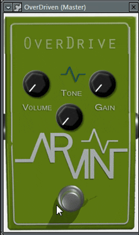

# Pedal Efek Overdrive dengan Delphi 7

Proyek ini adalah pedal efek overdrive sederhana yang dikembangkan menggunakan Delphi 7. Pedal ini memungkinkan Anda untuk menambahkan efek overdrive ke suara gitar Anda dan mengendalikan tiga parameter, yaitu tone, gain, dan volume.

## Fitur

- **Efek Overdrive**: Efek overdrive yang dapat disesuaikan untuk memberikan karakter suara gitar yang lebih berdistorsi.
- **Tone**: Mengatur karakteristik nada suara gitar yang dihasilkan oleh efek overdrive.
- **Gain**: Mengatur sejauh mana efek overdrive diterapkan ke sinyal gitar.
- **Volume**: Mengatur tingkat volume dari efek overdrive.
- **Antarmuka Pengguna Sederhana**: Antarmuka pengguna yang mudah digunakan untuk mengontrol pedal efek overdrive.

## Persyaratan

- Delphi 7 atau versi yang lebih tinggi.
- Kompatibel dengan sistem operasi Windows.

## Penggunaan

1. Buka proyek dalam Delphi 7.
2. Kompilasi proyek untuk membuat eksekusi.
3. Jalankan eksekusi pedal efek overdrive.
4. Hubungkan gitar Anda ke komputer Anda menggunakan antarmuka audio yang sesuai.
5. Sesuaikan knob tone, gain, dan volume sesuai keinginan Anda.

## Kontribusi

Kami sangat menghargai kontribusi Anda untuk proyek ini. Jika Anda ingin berkontribusi, silakan buat _pull request_ dan kami akan mempertimbangkan untuk menggabungkannya.

## Lisensi

Proyek ini dilisensikan di bawah lisensi MIT. Lihat [LISENSI](LISENSI.md) untuk informasi lebih lanjut.

## Dukungan

Jika Anda memiliki pertanyaan atau masalah terkait proyek ini, silakan buka _issue_ di repositori ini atau hubungi kami melalui [fajarjulyana1@gmail.com](mailto:fajarjulyana1@gmail.com).

Terima kasih telah menggunakan pedal efek overdrive Delphi 7!

